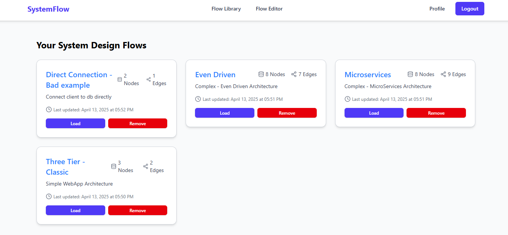
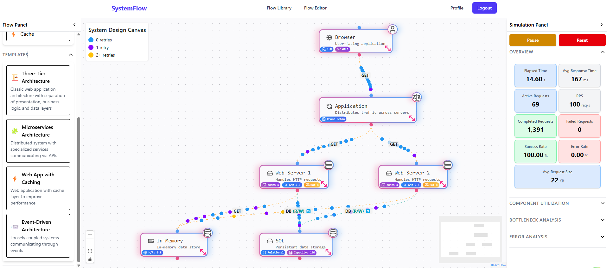

# Interactive Software Architecture Simulation System

A full-stack web application for simulating, visualizing, and analyzing software architecture designs with real-time performance metrics and data flow visualization.

## 🚀 Features

- **Architecture Template Library**: Pre-defined templates for common architectures (microservices, monolithic, serverless, etc.)
- **Drag & Drop Interface**: Intuitive component placement and connection for building custom architectures
- **Real-time Simulation Engine**: Analyze performance metrics and identify bottlenecks in your system design
- **Dynamic Data Flow Visualization**: Watch how data moves between components (Database, Client, Server, Cache, etc.)
- **Performance Analysis**: Identify bottlenecks and common architectural errors
- **Exportable Reports**: Generate comprehensive reports on architecture performance and recommendations

## 💻 Tech Stack

### Backend

- Node.js & Express for RESTful API development
- MongoDB with Mongoose for database management and object modeling
- JWT authentication and middleware for security
- CI/CD pipeline with GitHub Actions
- Containerization with Docker

### Frontend

- React with TypeScript for robust UI development
- Vite for fast development experience
- React Flow for interactive node-based simulation
- Tailwind CSS for responsive design
- Custom simulation engine using directed graph algorithms

## 📊 Implementation Details

The system employs a directed graph data structure to model the relationships between different architectural components. The simulation engine uses randomization along with predefined parameters to create realistic data flow scenarios that architects can use to make informed decisions about their system design.

## 🖼️ Screenshots

_Available components for architecture design_

_Real-time performance metrics and bottleneck identification_

## 🔄 CI/CD Pipeline

This project implements a robust CI/CD pipeline using GitHub Actions:

- Automated testing on pull requests
- Linting and code quality checks
- Docker image building and publishing
- Automatic deployment to staging environment

## 🤝 Contributing

Contributions are welcome! Please feel free to submit a Pull Request.

## 📝 License

This project is licensed under the MIT License - see the LICENSE file for details.
